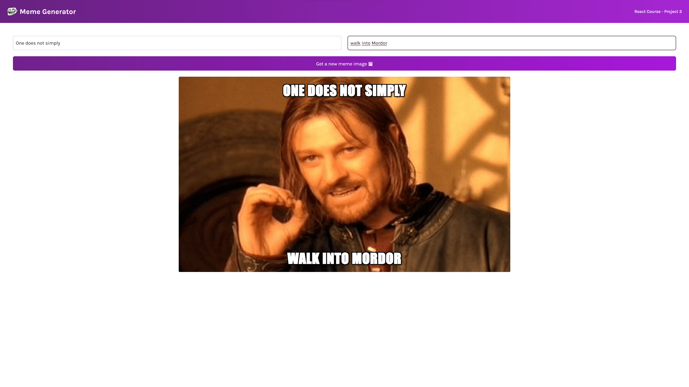

## Meme Generator

✔ Calls an API that generates random memes and attaches a top and bottom text to them.  
✔ Built with React.  
✔ Fully dynamic with Props, useState and useEffect.  
✔ Responsive.  

### [Check it out](https://renanmdp.github.io/meme-generator/)

## Gerador de Memes

✔ UChama uma API que gera memes aleatórios e fixa textos no topo e fundo.  
✔ Construído com React.  
✔ Inteiramente dinâmico com Props, useReact e useEffect.  
✔ Responsivo.  

### [Confira](https://renanmdp.github.io/meme-generator/)

